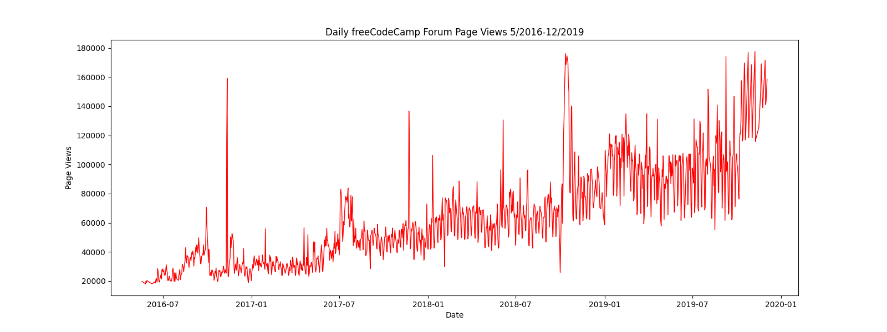
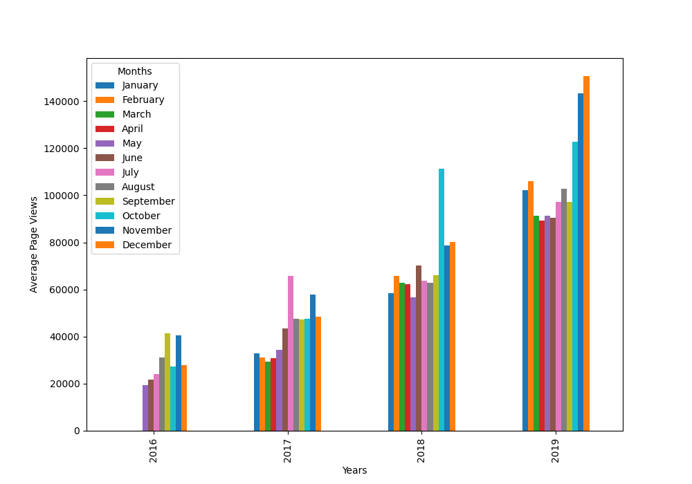
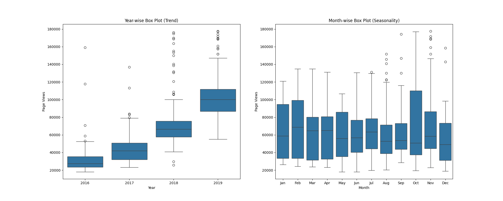

# Page View Time Series Visualizer

This project is part of the **freeCodeCamp Data Analysis with Python** curriculum.  
It analyzes daily page views on the freeCodeCamp.org forum between **May 2016** and **December 2019**, and visualizes the trends through line plots, bar plots, and box plots.

---

## 📊 Project Description

The main steps in the project are:
1. **Data Importing & Cleaning**  
   - Load the dataset from `fcc-forum-pageviews.csv`.  
   - Parse dates and set the `date` column as the index.  
   - Remove outliers by keeping only values between the 2.5th and 97.5th percentiles.
   
2. **Visualization**  
   - **Line Plot**: Shows daily page views over the time period.  
   - **Bar Plot**: Displays monthly average page views for each year.  
   - **Box Plots**:  
     - Year-wise trend visualization  
     - Month-wise seasonality patterns

---

## 📈 Visualizations

### 1️⃣ Line Plot
Daily freeCodeCamp Forum Page Views from **May 2016** to **December 2019**.

---

### 2️⃣ Bar Plot
Average monthly page views for each year.

---

### 3️⃣ Box Plots
- **Year-wise Box Plot (Trend)**: How the page views changed over years.  
- **Month-wise Box Plot (Seasonality)**: Patterns within each year.

---

## 🛠️ Technologies Used
- **Python** (Pandas, Matplotlib, Seaborn)
- Jupyter Notebook / IDE
- CSV data handling

---

📌 **Notes**  
- The dataset is publicly available as part of the *freeCodeCamp Data Analysis with Python* certification.  
- Outliers were removed to improve plot clarity.  
